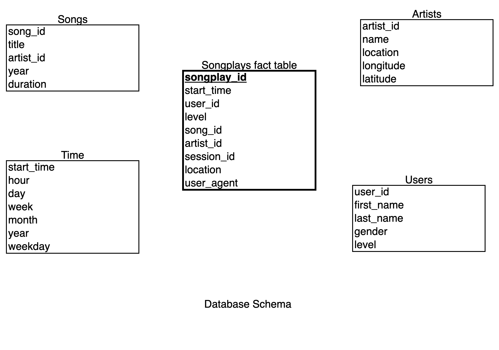

# Sparkify RDMS ETL

## Table of contents

- [Sparkify RDMS ETL](#sparkify-rdms-etl)
  - [Overview](#overview)
  - [Dataset](#dataset)
    - [Song Dataset](#song-dataset)
    - [Log Dataset](#log-dataset)
  - [Database Schema](#database-schema)
  - [Project Setup](#project-setup)
  - [Project Structure](#project-structure)

## Overview

A startup called Sparkify wants to analyze the data they've been collecting on songs and user activity on their new music streaming app. The analytics team is particularly interested in understanding what songs users are listening to. Currently, they don't have an easy way to query their data, which resides in a directory of JSON logs on user activity on the app, as well as a directory with JSON metadata on the songs in their app.

They'd like a data engineer to create a _*Postgres*_ database with tables designed to optimize queries on song play analysis. Thus, the goal is to **create a database schema and ETL pipeline** for this analysis.

## Dataset

#### Song Dataset

The first dataset is a subset of real data from the Million Song Dataset. Each file is in JSON format and contains metadata about a song and the artist of that song.

#### Log Dataset

The second dataset consists of log files in JSON format generated by an event simulator based on the songs in the dataset above. These simulate activity logs from a music streaming app based on specified configurations.

## Database Schema

The schema used for this exercise is the Star Schema: There is one main fact table containing all the measures associated to each event (user song plays), and 4 dimentional tables.



## Project Structure

```
├── data: contains both datasets
│ ├── song_data
│ └── log_data
├── sql_queries.py
├── create_tables.py: script to run queries the queries to create/drop the database defined in sql_queries.py
└── etl.py: the main script to run the pipeline.
```

## Project Setup

1. Make sure to have [Poetry Package Manager](https://python-poetry.org/) installed.

2. Run `poetry install` to install the dependencies.

3. Rename `.env.sample` to `.env` and update the variables to reflect your settings.

4. Run `python3 create_tables.py` to create the database and tables.

5. Run `python3 etl.py` to run the ETL pipeline.
